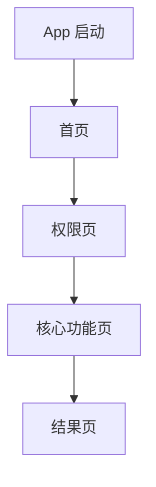

你现在是一个 App 项目代码信息采集助手。请在当前项目中进行只读扫描，不要修改任何代码、配置或资源文件。

本阶段的任务只有一个：**从代码中客观搜集项目信息**。

请不要做经营分析，不要做数据分析，不要评估好坏，不要提出优化建议，不要推荐补充埋点。
只需要把代码中真实存在的页面、页面关系、广告位、订阅/付费触发点、埋点事件整理出来。

请将 Markdown 报告保存到当前项目根目录下的：

`app_analysis/APP_PROJECT_SCAN_REPORT.md`

如果当前项目根目录下不存在 `app_analysis` 目录，请先创建该目录。

---

# App 项目信息扫描报告

## 1. 项目基本信息

请根据代码客观识别以下信息：

| 项目项                       | 扫描结果 | 代码位置 / 依据 | 备注 |
| ------------------------- | ---- | --------- | -- |
| 项目类型                      |      |           |    |
| 主要语言                      |      |           |    |
| 主要框架                      |      |           |    |
| App 入口文件                  |      |           |    |
| Root 页面 / Root Controller |      |           |    |
| 主要导航方式                    |      |           |    |
| 是否包含广告 SDK                |      |           |    |
| 是否包含订阅 / 内购代码             |      |           |    |
| 是否包含埋点 SDK                |      |           |    |

如果无法确定，请写“未确认”，不要猜测。

---

## 2. 主要目录结构

请整理项目中和 App 业务流程相关的主要目录。

表格格式：

| 目录 / 文件 | 作用 | 备注 |
| ------- | -- | -- |

重点关注：

* App 入口
* 页面目录
* 组件目录
* 路由 / 导航目录
* 广告相关目录
* 订阅 / 内购相关目录
* 埋点 / Analytics 相关目录
* 网络请求目录
* 工具类目录
* 资源配置目录

---

## 3. 页面清单

请扫描项目中的页面、Controller、Fragment、View、Screen、Route、ViewController、Storyboard 页面等。

表格格式：

| 页面名称 | 代码文件 | 页面类型 | 代码中的主要职责 | 备注 |
| ---- | ---- | ---- | -------- | -- |

页面类型可选：

* Root
* Home
* Onboarding
* Permission
* Feature
* List
* Detail
* Result
* Paywall
* Settings
* WebView
* Popup
* BottomSheet
* Other
* Unknown

要求：

1. 只记录代码中能确认的页面。
2. 不要根据名字过度推断业务含义。
3. 不要把“进入页面”解释为“完成某个功能”。
4. 如果页面作用不明确，请在备注中写“不明确”。

---

## 4. 页面跳转关系

请根据代码中的导航、按钮点击、回调、路由配置，整理页面之间的跳转关系。

表格格式：

| 来源页面 | 目标页面 | 触发动作 | 代码位置 | 跳转方式 | 备注 |
| ---- | ---- | ---- | ---- | ---- | -- |

触发动作示例：

* App 启动
* 点击按钮
* Tab 切换
* 权限回调
* 广告关闭回调
* 购买成功回调
* 功能完成回调
* 返回操作
* Deeplink
* 自动跳转
* 其他

跳转方式示例：

* push
* present
* modal
* replace root
* tab switch
* route navigation
* callback
* unknown

要求：

1. 只记录代码中能确认的跳转。
2. 如果只发现跳转代码，但来源或目标不明确，请标注“不明确”。
3. 不要评价跳转设计是否合理。

---

## 5. 页面关系图

请基于已确认的页面跳转关系，输出 Mermaid 图。

格式示例：



要求：

1. 只画代码中能确认的关系。
2. 如果页面很多，请优先画主流程。
3. 不要在图中加入推测性关系。
4. 不要在图后做分析结论。

---

## 6. 广告 SDK 与广告代码

请扫描项目中的广告相关代码。

重点搜索关键词包括但不限于：

```text
ad
ads
AdMob
GAD
AppLovin
MAX
UnityAds
IronSource
TopOn
Pangle
interstitial
rewarded
banner
native
appOpen
openAd
showAd
loadAd
reward
```

请输出广告 SDK / 广告管理类信息。

表格格式：

| 名称 | 类型 | 代码位置 | 主要职责 | 备注 |
| -- | -- | ---- | ---- | -- |

类型可选：

* SDK
* Manager
* Helper
* Config
* Model
* View
* Unknown

---

## 7. 广告位清单

请整理代码中真实存在的广告位、广告展示方法和广告触发位置。

表格格式：

| 广告位名称 / 方法 | 广告位ID |  广告类型 | 所在页面 / 调用位置 | 触发时机 | 代码位置 | 备注 |
| ----------  |-------| ---- | ----------- | ---- | ---- | -- |

广告类型可选：

* App Open
* Interstitial
* Rewarded
* Banner
* Native
* Splash
* Unknown

触发时机示例：

* App 启动
* 页面进入时
* 页面内操作前（注明具体操作）
* 点击按钮
* 功能开始前
* 功能完成后
* 结果页展示前
* 保存前
* 返回时
* 定时触发
* 回调触发
* 其他
* 不明确

要求：

1. 只记录代码中真实存在的广告调用。
2. 不要评价广告是否影响体验。
3. 不要判断广告位优劣。
4. 如果广告类型或触发时机不明确，请写“不明确”。
5. 对于插屏广告，必须区分是“页面进入时展示”，还是“页面内某个操作执行前展示”；如果是后者，请写明具体操作，不要笼统记录为“页面展示”。

---

## 8. 订阅 / 内购 / Paywall 相关代码

请扫描项目中的订阅、内购、会员、付费页相关代码。

重点搜索关键词包括但不限于：

```text
iap
purchase
subscribe
subscription
paywall
premium
pro
trial
restore
unlock
entitlement
StoreKit
RevenueCat
product
transaction
```

请输出相关代码清单。

表格格式：

| 名称 | 类型 | 代码位置 | 主要职责 | 备注 |
| -- | -- | ---- | ---- | -- |

类型可选：

* Paywall Page
* Purchase Manager
* Product Config
* Subscription State
* Restore Purchase
* Receipt Verify
* Helper
* Unknown

---

## 9. 订阅 / Paywall 触发点清单

请整理代码中真实存在的订阅页、内购页、付费弹窗、会员判断、功能锁触发点。

表格格式：

| 触发点名称 / 方法 | 所在页面 / 调用位置 | 触发动作 | 代码位置 | 触发条件 | 备注 |
| ---------- | ----------- | ---- | ---- | ---- | -- |

触发动作示例：

* App 启动后
* 点击按钮
* 点击 Pro 功能
* 查看结果前
* 保存结果前
* 使用次数达到上限
* 广告关闭后
* 购买失败后
* 恢复购买
* 其他
* 不明确

要求：

1. 只记录代码中能确认的触发点。
2. 不要评价 Paywall 是否过早或过晚。
3. 不要判断转化效果。
4. 如果触发条件不明确，请写“不明确”。

---

## 10. 埋点 / Analytics 相关代码

请扫描项目中的数据埋点相关代码。

重点搜索关键词包括但不限于：

```text
analytics
logEvent
track
event
Firebase
Adjust
AppsFlyer
Amplitude
Mixpanel
revenue
screen_view
purchase
ad_revenue
```

请输出埋点 SDK / 埋点管理类信息。

表格格式：

| 名称 | 类型 | 代码位置 | 主要职责 | 备注 |
| -- | -- | ---- | ---- | -- |

类型可选：

* SDK
* Analytics Manager
* Event Helper
* Event Constants
* Revenue Tracking
* Screen Tracking
* Unknown

---

## 11. 埋点事件清单

请整理代码中真实存在的埋点事件。

表格格式：

| 事件名 | 代码位置 | 触发页面 / 调用位置 | 触发动作 | 事件参数 | 备注 |
| --- | ---- | ----------- | ---- | ---- | -- |

要求：

1. 只记录代码中真实出现的事件。
2. 不要补充代码里不存在的事件。
3. 不要推荐新增事件。
4. 不要评价埋点是否完整。
5. 如果事件参数为空，请写“无”。
6. 如果触发动作不明确，请写“不明确”。

---

## 12. 关键配置文件

请整理和项目运行、广告、订阅、埋点相关的配置文件。

表格格式：

| 配置文件 | 相关模块 | 代码位置 | 配置内容摘要 | 备注 |
| ---- | ---- | ---- | ------ | -- |

重点关注：

* Info.plist
* AndroidManifest.xml
* GoogleService-Info.plist
* google-services.json
* Firebase 配置
* AdMob 配置
* RevenueCat 配置
* StoreKit 配置
* 产品 ID 配置
* 远程配置
* 环境变量
* build config

注意：不要泄露密钥。如果发现 key、token、secret，只说明“存在敏感配置”，不要完整输出。

---

## 13. 外部 SDK / 依赖清单

请根据依赖文件整理项目使用的主要外部 SDK。

表格格式：

| SDK / 依赖名称 | 用途 | 依赖文件位置 | 版本 | 备注 |
| ---------- | -- | ------ | -- | -- |

依赖文件可能包括：

* Package.swift
* Podfile
* Podfile.lock
* Cartfile
* build.gradle
* pubspec.yaml
* package.json
* yarn.lock
* pnpm-lock.yaml

重点关注：

* 广告 SDK
* 订阅 / 内购 SDK
* 数据分析 SDK
* 崩溃统计 SDK
* 远程配置 SDK
* 网络请求 SDK
* 图片 / 视频处理 SDK

---

## 14. 扫描中未确认的信息

请把扫描过程中未能确认的信息单独列出。

表格格式：

| 未确认项 | 已检查位置 | 未确认原因 | 备注 |
| ---- | ----- | ----- | -- |

要求：

1. 只列事实。
2. 不要给建议。
3. 不要推测原因。
4. 不要评价风险。

---

## 输出要求

1. 输出完整 Markdown。
2. 所有结论尽量附带代码文件路径。
3. 能附函数名、类名、方法名的地方尽量附上。
4. 不要修改代码。
5. 不要运行破坏性命令。
6. 不要做经营分析。
7. 不要做数据分析。
8. 不要做风险评估。
9. 不要提出优化建议。
10. 不要推荐新增埋点。
11. 不要把代码中不存在的事件、页面、广告位、订阅触发点补进去。
12. 对不确定的信息统一写“未确认”或“不明确”。

请现在开始只读扫描当前项目，并将《App 项目信息扫描报告》保存到当前项目根目录下的 `app_analysis/APP_PROJECT_SCAN_REPORT.md`；如果 `app_analysis` 目录不存在，请先创建。
